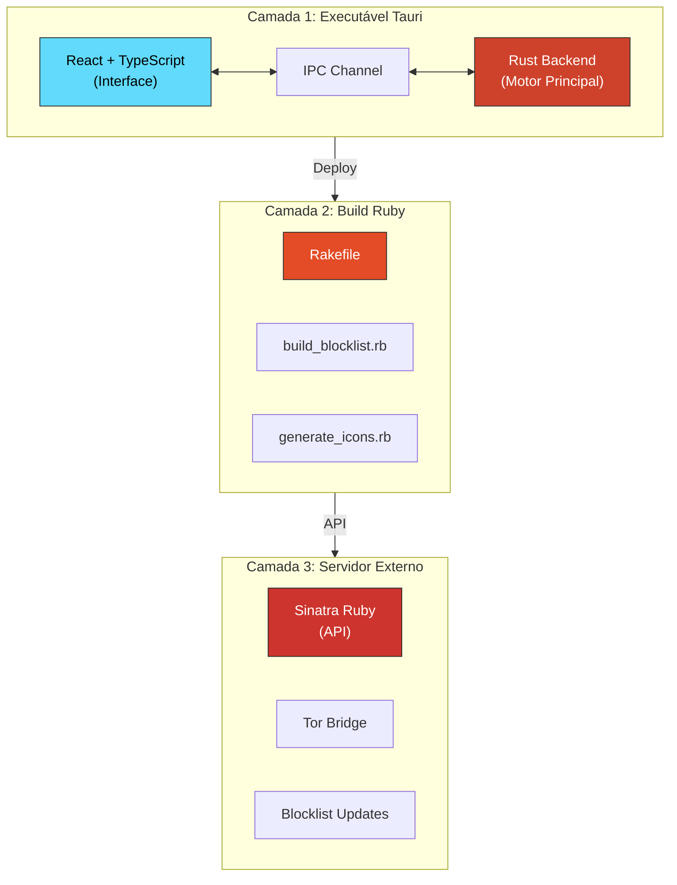

# KeepCalm Web Browser

| Status | Platform | Repository | License |
|--------|----------|-----------|---------|
| Stable | Windows 10+ | [GitHub](https://github.com/ryhanschutz/keepcalm_web) | MIT |

Navegador desktop de alto desempenho focado em privacidade, segurança e anti-rastreamento. Construído com Tauri (Rust + TypeScript) para máximo controle e eficiência.

## Características

| Funcionalidade | Descrição |
|---|---|
| Privacidade Total | Motor anti-rastreamento com 153k+ regras de bloqueio |
| Segurança Integrada | Proteção contra fingerprinting e captura de dados |
| Alto Desempenho | Interface responsiva com renderização otimizada |
| Bypass de Rede | Suporte para Tor, WireGuard e VPN |
| Modo Anônimo | Navegação sem deixar rastros locais |
| Gerenciamento de Abas | Persistência automática de sessão |
| Interface Moderna | Dark Mode com design minimalista |

## Índice

- [Requisitos](#requisitos)
- [Instalação](#instalação)
- [Arquitetura](#arquitetura)
- [Desenvolvimento](#desenvolvimento)
- [Build](#build)
- [Estrutura do Projeto](#estrutura-do-projeto)
- [Roadmap](#roadmap)
- [Contribuindo](#contribuindo)
- [Licença](#licença)

## Requisitos

| Componente | Versão |
|---|---|
| Windows | 10+ |
| Node.js | 18+ |
| Rust | 1.70+ |
| Ruby | 3.0+ |

## Instalação

### Download do Executável

Acesse [Releases](https://github.com/ryhanschutz/keepcalm_web/releases) para baixar a versão mais recente.

### Build Local

```bash
git clone https://github.com/ryhanschutz/keepcalm_web.git
cd keepcalm_web
npm install
npm run tauri dev
```

O executável final estará em `src-tauri/target/release/bundle/msi/`.

## Arquitetura



### Camada 1: Executável

Produz um binário `.exe` contendo:

- Frontend React com TypeScript
- Backend Rust para rede, privacidade e Tor
- Database SQLite com 153k+ regras
- WebView2 integrado

### Camada 2: Build

Scripts de desenvolvimento em Ruby:

- `Rakefile` - Orquestração
- `build_blocklist.rb` - Geração de regras
- `generate_icons.rb` - Processamento de ícones

### Camada 3: Servidor

Backend externo para:

- Atualização de blocklist
- Integração Tor
- Gerenciamento de versões

## Desenvolvimento

### Estrutura do Projeto

```
keepcalm_web/
├── keepcalm-web/           Frontend Tauri
│   ├── src/                TypeScript + React
│   │   ├── components/     Componentes React
│   │   ├── store/          Zustand state
│   │   ├── styles/         CSS modules
│   │   └── utils/          Utilitários
│   └── src-tauri/          Backend Rust
│       ├── src/
│       │   ├── commands/   IPC commands
│       │   ├── network/    Módulos rede
│       │   └── privacy/    Módulos privacidade
│       └── Cargo.toml
├── scripts/                Build scripts Ruby
├── server/                 Backend Sinatra
└── spec/                   Testes RSpec
```

### Ambiente de Desenvolvimento

Para iniciar o ambiente de desenvolvimento em dois terminais:

**Terminal 1: Servidor Vite**
```bash
cd keepcalm-web
npm run dev
```

**Terminal 2: Aplicação Tauri**
```bash
cd keepcalm-web
npm run tauri dev
```

### Comandos Principais

| Comando | Descrição |
|---------|-----------|
| `npm run dev` | Servidor Vite em desenvolvimento |
| `npm run tauri dev` | Aplicação Tauri em desenvolvimento |
| `npm run lint` | Executar linter |
| `npm run format` | Formatar código |
| `npm run tauri build` | Build executável |
| `bundle exec rspec` | Testes Ruby |

## Build

### Desenvolvimento

```bash
npm run tauri dev
```

Abre a aplicação com DevTools habilitadas.

### Release (Windows)

```bash
npm run tauri build
```

Gera instalador `.msi` em `src-tauri/target/release/bundle/msi/`.

### Blocklist

```bash
cd scripts
ruby build_blocklist.rb
```

Compila regras anti-rastreamento para `blocklist.db`.

## Estrutura do Projeto

| Caminho | Conteúdo |
|---------|----------|
| `keepcalm-web/` | Aplicativo principal Tauri |
| `keepcalm-web/src/` | Frontend React e TypeScript |
| `keepcalm-web/src-tauri/` | Backend Rust |
| `keepcalm-web/src-tauri/src/commands/` | Endpoints IPC |
| `keepcalm-web/src-tauri/src/network/` | Módulos de rede |
| `keepcalm-web/src-tauri/src/privacy/` | Módulos de privacidade |
| `scripts/` | Scripts Ruby de build |
| `server/` | Backend Sinatra externo |
| `spec/` | Testes RSpec |

## Roadmap

### Fase 1: Estabilização ✓

- Motor anti-rastreamento funcional
- Gerenciamento de abas persistente
- Stealth features (global hotkey, taskbar)
- UI estável

### Fase 2: Privacidade Avançada

| Item | Status |
|------|--------|
| Integração Tor completa | Planejado |
| Fingerprint stealth refinado | Planejado |
| WireGuard integrado | Planejado |
| Modo anônimo persistente | Planejado |

### Fase 3: Funcionalidades

| Item | Status |
|------|--------|
| Download manager | Pendente |
| Histórico sincronizado | Pendente |
| Extensões de navegador | Pendente |
| Sincronização P2P | Pendente |

### Fase 4: Polish

| Item | Status |
|------|--------|
| Micro-animações | Pendente |
| Modo Foco | Pendente |
| Temas customizáveis | Pendente |
| Acessibilidade completa | Pendente |

## Contribuindo

Para contribuir:

1. Fork o repositório
2. Crie branch de feature: `git checkout -b feature/nova-funcionalidade`
3. Commit suas mudanças: `git commit -m 'Adiciona nova funcionalidade'`
4. Push para a branch: `git push origin feature/nova-funcionalidade`
5. Abra um Pull Request

### Diretrizes de Código

- Rust: `cargo fmt` + `clippy`
- TypeScript: Tipos completos obrigatórios
- Testes: Cobertura mínima 80%
- Documentação: Todas as APIs públicas

## Documentação

| Documento | Descrição |
|-----------|-----------|
| [Especificação Técnica](./KeepCalm_Web_Especificacao_Tecnica.md) | Detalhes arquiteturais e design |
| [Documentação Unificada](./KeepCalm_Web_Documentacao_Unificada.md) | Guia completo de desenvolvimento |
| [Relatório de Status](./RELATORIO_STATUS_KEEP_CALM.md) | Estado atual e progresso |

## Reportando Issues

Encontrou um problema? Abra uma [issue](https://github.com/ryhanschutz/keepcalm_web/issues) incluindo:

- Descrição clara do problema
- Passos para reproduzir
- Logs de erro relevantes
- Versão do Windows

## Licença

MIT License - Veja [LICENSE](./LICENSE) para detalhes.

## Suporte

| Canal | Link |
|-------|------|
| Issues | [GitHub Issues](https://github.com/ryhanschutz/keepcalm_web/issues) |
| Wiki | [GitHub Wiki](https://github.com/ryhanschutz/keepcalm_web/wiki) |
| Email | [contato@example.com](mailto:contato@example.com) |

---

**KeepCalm Web Browser** | Privacidade, Segurança e Controle
